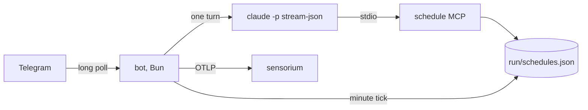

# agent-template

> A Telegram bot whose every turn is a headless Claude Code run. Write a persona, collect three tokens, `docker compose up`.

`telegram` · `claude-code` · `docker` · `template`

[](https://github.com/zyx1121/agent-template/actions) &nbsp;[](https://github.com/zyx1121/agent-template/pkgs/container/agent-template) &nbsp;[](#license)

Every new bot idea starts with the same chores: wire up Telegram, run Claude Code headlessly, remember reminders after the process exits, ship files both ways. This repo is that wiring, done once. A new agent is a `SOUL.md`, an `.env` and, when it needs its own tools, a three-line Dockerfile on top of this image.

```
> "is the deploy healthy?"
  ⚡️ Bash gh run list --limit 1
  🔧 sensorium.error_summary
✓ Last deploy passed 2 hours ago, no errors since.
```

<sub>In a private chat the answer streams in as an animated draft with a stop button; in a group, one progress message updates with every tool call.</sub>

## What it does

- **Bridges** Telegram and Claude Code: one long-poll process, no open port, one rolling `claude -p` session per chat.
- **Streams** replies: Markdown rendered as Telegram rich messages, drafts with a stop button in private chats, a progress message in groups.
- **Persists** reminders: a builtin `schedule` MCP server writes `run/schedules.json`, and a minute tick fires them.
- **Moves** files both ways: attachments are saved with their path in the prompt, anything put in the outbox comes back after the turn.
- **Reports** to OpenTelemetry: `agent.turn` spans and event logs, ready for [sensorium](https://github.com/zyx1121/sensorium).

## Deploy

With Docker Compose, on any machine with Docker:

```sh
curl -fsSLO https://raw.githubusercontent.com/zyx1121/agent-template/main/compose.yaml
curl -fsSL -o .env https://raw.githubusercontent.com/zyx1121/agent-template/main/.env.example
touch mcp-config.json   # or your own MCP servers, see Configure
# set TELEGRAM_BOT_TOKEN, OWNER_USER_ID and CLAUDE_CODE_OAUTH_TOKEN in .env
docker compose up -d
```

That starts `ghcr.io/zyx1121/agent-template` with the template persona. Its state (sessions, schedules, files and Claude Code's own session store) lives in `./run`, so an image upgrade keeps every conversation and reminder.

> [!IMPORTANT]
> Every turn runs with `--permission-mode bypassPermissions` inside the container. Anyone the bot serves (you, and members of allowed groups) can make it run any command there, with the tokens you give it.

## Make your own agent

```sh
gh repo create my-agent --template zyx1121/agent-template --private --clone
```

1. **Persona**: rewrite `SOUL.md`; it is appended to Claude Code's system prompt on every turn.
2. **Tools**: if turns need more than `git`, `gh`, `curl`, `jq` and `rg`, extend the image:
   ```dockerfile
   FROM ghcr.io/zyx1121/agent-template:1
   USER root
   RUN apt-get update && apt-get install -y --no-install-recommends nodejs npm && npm i -g vercel
   USER agent
   COPY --chown=agent SOUL.md ./
   COPY --chown=agent .claude ./.claude
   ```
   Skills in `.claude/skills/` load automatically because the bot runs from `/app`.
3. **Tokens**: [@BotFather](https://t.me/BotFather) `/newbot` for `TELEGRAM_BOT_TOKEN`, [@userinfobot](https://t.me/userinfobot) for `OWNER_USER_ID`, and `claude setup-token` on a machine with a browser for `CLAUDE_CODE_OAUTH_TOKEN`.
4. `docker compose up -d --build`.

Upgrading a fork is changing the `FROM` tag.

## Use

- Message the bot in a private chat. `/new` starts a fresh conversation, `/start` checks it is up.
- Groups: in @BotFather `/setprivacy` → Disable, add the bot, @mention it once; it answers with the group's id. Put the id in `ALLOWED_GROUP_IDS` and restart. In a group only @mentions and replies to the bot start a turn, and each message is tagged with the sender's name.
- Reply to or quote an earlier message and its text is added as context, even hours later.
- Ask for reminders in plain words ("every weekday at 9, summarise new issues"); Claude manages them through `mcp__schedule__*`. For a monitoring job, ask it to answer `NO_REPLY` when there is nothing to say and that run stays silent.

## Configure

Set these in `.env`; [.env.example](.env.example) documents every one.

| Key | What it sets | Default |
|-----|--------------|---------|
| `TELEGRAM_BOT_TOKEN` | The bot | required |
| `OWNER_USER_ID` | The one user always served | required |
| `CLAUDE_CODE_OAUTH_TOKEN` | Claude Code auth, from `claude setup-token` | required |
| `ALLOWED_GROUP_IDS` | Groups the bot answers in, comma-separated | none |
| `AGENT_NAME` | Display name, and the telemetry service name | `Agent` |
| `AGENT_MODEL` | Claude Code model | Claude Code's default |
| `AGENT_TURN_TIMEOUT` | Seconds before a turn is stopped | `1800` |
| `SENSORIUM_URL`, `SENSORIUM_TOKEN` | OTLP/HTTP JSON export | off |

Extra MCP servers go in `mcp-config.json` (mounted read-only, never in the image). Turns run with `--strict-mcp-config`, so these and the builtin `schedule` server are the only ones a turn sees:

```json
{ "mcpServers": { "sensorium": { "type": "http", "url": "https://sensorium.example.com/mcp", "headers": { "Authorization": "Bearer <token>" } } } }
```

## How it works



The bot runs one turn at a time, resuming the chat's session from `run/session-<chat>`. It reads `claude`'s stream for text deltas and tool calls, which drive the draft or the progress message, then sends the final reply as Markdown. Failures are classified: usage limits and transient errors stay quiet on scheduled runs because they heal themselves, while an auth failure always surfaces. Tokens reach the process only as environment, and every log line has them redacted.

## Develop

```sh
bun install
cp .env.example .env
bun src/main.ts
```

`bun test` covers cron, the schedule store and its MCP server, prompt framing and error classes; `bunx tsc --noEmit` typechecks. `bun test/live-turn.ts` runs one real turn (needs `CLAUDE_CODE_OAUTH_TOKEN`). CI runs both, builds the image, and checks that the container and the compose stack start and explain missing configuration instead of crash-looping. Every push to main publishes `:sha-<commit>` and `:main`; a `v*` tag publishes the SemVer tags and `:latest`.

## Limitations

- One turn at a time across all chats; a long turn delays the others.
- Schedules missed while the bot was down are skipped, not replayed (delays under 5 minutes are caught up). Cron uses the container's clock, `Asia/Taipei` by default (`TZ`).
- Drafts and the stop button work in private chats only; Telegram does not offer them in groups.
- Telegram lets bots download files up to 20 MB.

## Contributing

Issues and PRs welcome: ground rules in [CONTRIBUTING.md](https://github.com/zyx1121/.github/blob/main/CONTRIBUTING.md).

## License

[MIT](LICENSE). Fork it, rename the bot, make it yours.
